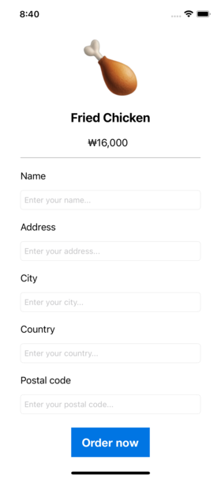
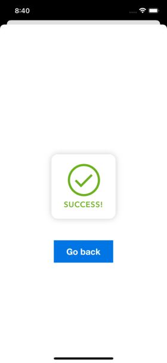

# chickenOrderApp

 

    
  </a>

  <h3 align="center">Chicken Order App</h3>
  

   A simple IOS application for ordering chicken 🍗
  

## UI

## Main Features
- User can enter his/her details before ordering chicken
- By pressing "Order now" the new window appears which is used to notify the successful purchase

Copyright (c) 2022 Assankhanov Arman